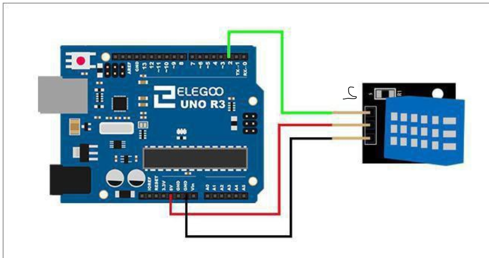
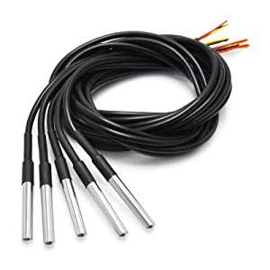

Using https://thingspeak.com/ to collect data from my sensors and analyse it.
I was using `platform io extension` on vscode.
Write more than 1 field of data to thingspeak.com.

> Then use thingspeak to send email (via IFTTT) and tweet if a threshold is passed.
### important info
> IFTTT, event name is "DHT11"

> To get your IFTTT Webhooks key, visit https://ifttt.com/maker_webhooks, then Documentation. You have to be logged in to IFTTT.

> edit your applets @ https://ifttt.com/p/username/applets/private

I have 2 fields; Temperature and Humidity.

## Components
1. Arduino Wifi Rev2
3. DHT11 Temperature and Humidity sensor
4. Male & Female connection cables

## References
1. [Moisture Sensor using HTTP POST Requests to Channel](https://www.mathworks.com/help/thingspeak/MoistureMonitor.html)
2. [Arduino Uno with WiFi Basic Setup](https://www.elithecomputerguy.com/2019/06/arduino-uno-with-wifi-basic-setup/)
3. [Post Temperature Data and Read from Channel](https://www.mathworks.com/help/thingspeak/read-and-post-temperature-data.html)
4. [Write Multiple Fields to thingspeak](https://github.com/mathworks/thingspeak-arduino/blob/master/examples/ArduinoUnoWiFi%20Rev2/WriteMultipleFields/WriteMultipleFields.ino)

Arduino wiring image

View the data [here](https://thingspeak.com/channels/1786772)

## Next step:

# Set up a DS18B20 Temperature Sensor system()

### Wiring:
VCC 5v to Red VCC
VCC 5V to 5K (4.7K) Ohm pull-up resistor to Yellow Data
Yellow Data Pin to desired Digital pin (You can put all three of these on a single digital pin.)
Ground to Black Ground

### Code:
You need two libraries to use these temperature sensors.
1) OneWire - Since I can't add links, Google for "GitHub PaulStoffregen/OneWire"
2) DallasTemperature - Google for "GitHub milesburton Arduino-Temperature-Control-Library"

Once all libraries are installed into your Arduino Lib folder, you can try it out:

#include <OneWire.h>
#include <DallasTemperature.h>
OneWire oneWire(7); // Digital Pin 7
DallasTemperature dTemp(oneWire);

void setup() {
Serial.begin(9600);
}

void loop() {
dTemp->requestTemperatures();
Serial.println("Temp @ Index 0: " + String(dTemp->getTempFByIndex(0))); // Get the first temperature.
}
